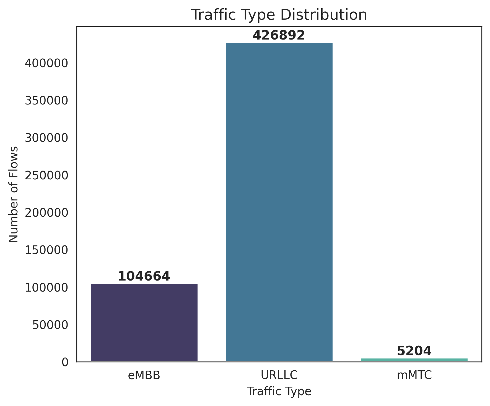
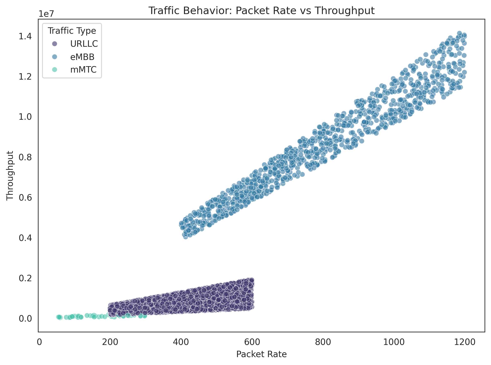
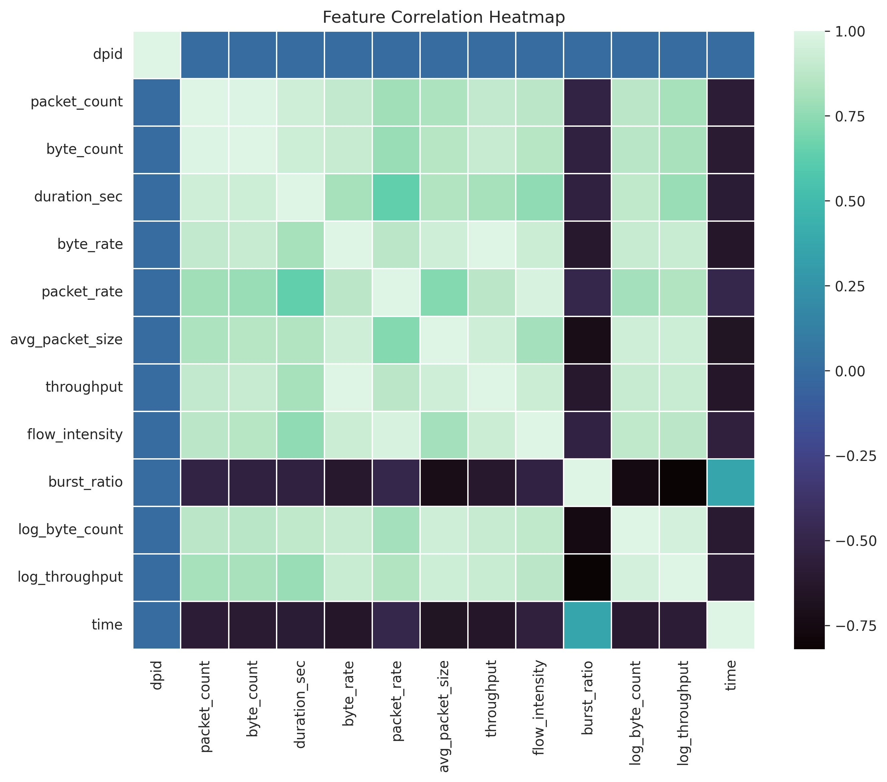
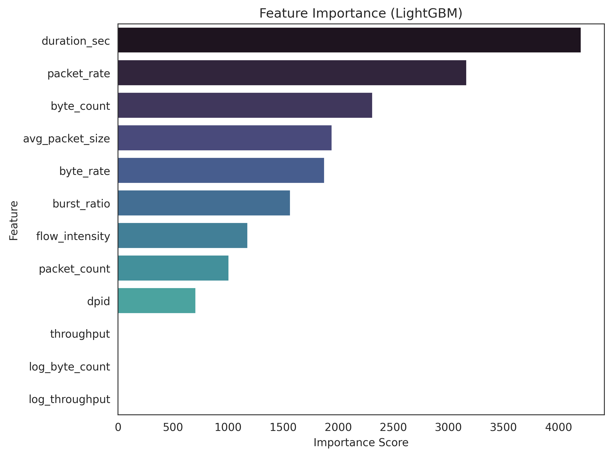

# SDN-Based-Traffic-Classification-AIML
SDN-based traffic classification using Mininet, RYU controller, and machine learning to differentiate real-time and bulk flows.
# 5G-Like Traffic Generation Using SDN (Mininet + RYU)

This document records the complete workflow and commands used to generate 5G-like traffic patterns using Mininet, RYU SDN Controller, and iperf3. The goal is to emulate eMBB, URLLC, and mMTC services in a controlled SDN environment.

---

## Step 1: Start the SDN Controller (Control Plane)

The SDN control plane is started using the RYU controller. A Python virtual environment is activated before launching the controller.

**Commands:**
```bash
source ~/ryuenv/bin/activate
ryu-manager ryu.app.simple_switch_13
```

*This initializes the SDN control plane and enables OpenFlow communication between the controller and Open vSwitch.*

---

## Step 2: Create the Mininet Network (Data Plane)

Mininet is used to create the SDN data plane. A tree topology is chosen to emulate a 5G-like core–access network structure.


**Command:**
```bash
sudo mn --controller=remote --topo=tree,depth=2,fanout=3 --switch=ovs
```

**This command:**
* Creates multiple Open vSwitch instances
* Builds a hierarchical topology
* Connects all switches to the remote RYU controller
* Treats hosts as UEs or IoT devices

---

## Step 3: Verify Network Connectivity

Before generating traffic, connectivity between all hosts is verified.

**Command:**
```bash
mininet> pingall
```

**Expected output:**
0% packet loss (Confirms that the SDN topology is correctly configured and stable).

---

## Step 4: Generate eMBB Traffic (High Throughput)

To emulate eMBB (Enhanced Mobile Broadband) traffic, TCP-based high-throughput traffic is generated.

1. Start an iperf3 server on host h1:
   ```bash
   mininet> h1 iperf3 -s &
   ```

2. Generate TCP traffic from host h2 to host h1:
   ```bash
   mininet> h2 iperf3 -c h1 -t 20
   ```

3. Save and view the output for analysis:
   ```bash
   mininet> h2 iperf3 -c h1 -t 20 > embb.txt
   mininet> h2 cat embb.txt
   ```

*This traffic represents 5G eMBB, characterized by sustained high bandwidth usage.*

---

## Step 5: Generate URLLC Traffic (Low Latency)

To emulate URLLC (Ultra-Reliable Low-Latency Communication), UDP traffic with controlled bandwidth is generated.

**Command:**
```bash
mininet> h3 iperf3 -u -b 1M -c h1 -t 20
```

**This traffic characteristics:**
* Uses UDP instead of TCP
* Maintains low latency
* Sends small packets
* Uses controlled bandwidth

---

## Step 6: Generate mMTC Traffic (IoT-Type Communication)

To emulate mMTC (Massive Machine-Type Communication), frequent small packets are generated using ICMP.

**Command:**
```bash
mininet> h4 ping h1 -i 0.2 -c 50
```

**Observed behavior:**
* RTT ≈ 0.05–0.07 ms
* 0% packet loss
* Reflects IoT-style communication with small packet sizes and high frequency.

---

## Traffic Validation Summary

The generated traffic patterns are clearly distinguishable:

| Service Type | Protocol | Characterization |
| :--- | :--- | :--- |
| eMBB | TCP | High-throughput / Large Data Transfer |
| URLLC | UDP | Low-latency / High Reliability |
| mMTC | ICMP | Massive connections / Small frequent packets |

---

## Final Status

**Completed tasks:**
- SDN controller initialized
- Mininet topology created
- Network connectivity verified
- eMBB traffic generated
- URLLC traffic generated
- mMTC traffic generated
- Traffic behavior validated

**Pending tasks:**
- Flow statistics collection
- Dataset creation (CSV)
- Machine learning classification
# 📊 Real-Time Flow Statistics Collection using SDN

This section documents the complete workflow and commands used to collect real-time OpenFlow flow statistics from an SDN network using Mininet and the RYU controller. These flow statistics are later used to build a machine-learning dataset for traffic classification.

---

## 🧠 Objective
To collect real-time flow-level statistics (packet count, byte count, flow duration) from a live SDN network while 5G-like traffic (eMBB, URLLC, mMTC) is actively flowing.

---

## 🏗️ Experimental Setup
* **SDN Controller:** RYU (OpenFlow 1.3)
* **Data Plane:** Mininet with Open vSwitch
* **Topology:** Tree topology (depth=2, fanout=3)
* **Traffic Generator:** iperf3 (TCP/UDP), ping (ICMP)
* **Monitoring:** Periodic OpenFlow FlowStatsRequest (1-second interval)
* **Output:** Real-time CSV dataset

---

## 🔹 Step 1: Activate Python Virtual Environment
Before starting the SDN controller, the Python virtual environment containing RYU and required dependencies is activated.

**Command:**
```bash
source ~/ryuenv/bin/activate
```

* ✔ Ensures correct RYU version
* ✔ Prevents dependency conflicts

---

## 🔹 Step 2: Start the Real-Time Flow Statistics Controller
A custom RYU controller application (`flow_stats_realtime.py`) is launched. This controller performs L2 packet forwarding, periodic statistics collection (1s interval), and real-time CSV writing.

**Commands:**
```bash
cd ~/ryu_apps
ryu-manager flow_stats_realtime.py
```

* ✔ Controller initializes the SDN control plane
* ✔ Flow monitoring starts immediately
* ✔ CSV file (`flow_stats.csv`) is created
* *Note: This terminal must remain running throughout the experiment.*

---

## 🔹 Step 3: Clean Previous Mininet State
Remove leftover Mininet state to avoid conflicts.

**Command:**
```bash
sudo mn -c
```
---

## 🔹 Step 4: Start Mininet Data Plane (5G-Like Topology)
Launch Mininet with a tree topology to emulate a hierarchical 5G-like network.


**Command:**
```bash
sudo mn \
--controller=remote,ip=127.0.0.1,port=6653 \
--switch=ovs,protocols=OpenFlow13 \
--topo=tree,depth=2,fanout=3
```
---

## 🔹 Step 5: Verify Network Connectivity
**Command:**
```bash
mininet> pingall
```

**Expected Output:**
`0% packet loss` (Confirms correct controller–switch–host communication).

---

## 🔹 Step 6: Start Traffic Sink (Server)
Host h1 is configured as the central server (5G core).

**Command:**
```bash
mininet> h1 iperf3 -s &
```

---

## 🔹 Step 7: Generate eMBB Traffic (High Throughput)
eMBB traffic is emulated using long-lived TCP flows.

**Commands:**
```bash
mininet> h2 iperf3 -c h1 -t 600 &
mininet> h3 iperf3 -c h1 -t 600 &
mininet> h4 iperf3 -c h1 -t 600 &
```

* **Characteristics:** High bandwidth, large byte counts, long-duration flows.

---

## 🔹 Step 8: Generate URLLC Traffic (Low Latency)
URLLC traffic is generated using UDP with controlled bandwidth.

**Commands:**
```bash
mininet> h5 iperf3 -u -b 1M -c h1 -t 600 &
mininet> h6 iperf3 -u -b 500K -c h1 -t 600 &
```

* **Characteristics:** Low latency, smaller payloads, high reliability.

---

## 🔹 Step 9: Generate mMTC Traffic (IoT-Like)
mMTC traffic is emulated using frequent ICMP packets.

**Commands:**
```bash
mininet> h7 ping h1 -i 0.2 -c 3000 &
mininet> h8 ping h1 -i 0.3 -c 2000 &
mininet> h9 ping h1 -i 0.4 -c 1500 &
```

* **Characteristics:** Small packets, high frequency, massive transmissions.

---

## 🔹 Step 10: Real-Time Flow Statistics Collection
While traffic runs, the RYU controller:
1. Sends `FlowStatsRequest` every 1 second.
2. Receives live flow counters.
3. Writes statistics continuously to CSV.

*⏱ Allow traffic to run for 10–15 minutes.*

---

## 🔹 Step 11: Stop Experiment
**Commands:**
```bash
mininet> exit
```
# Press Ctrl + C in the RYU terminal to stop the controller

---

## 🔹 Step 12: Verify Dataset Size
**Command:**
```bash
wc -l flow_stats.csv
```

**Example Output:**
`536761 flow_stats.csv`

---

## 🔹 Step 13: Backup Raw Dataset
**Command:**
```bash
cp flow_stats.csv flow_stats_raw_536k.csv
```
---

## 📊 Dataset Description
* **Format:** CSV
* **Collection Mode:** Real-time (online)
* **Features:** Packet count, Byte count, Flow duration, Timestamp
* **Dataset Size:** 536,000+ rows

---

## ✅ Summary
* ✔ Real-time SDN monitoring implemented
* ✔ Large-scale dataset generated
* ✔ Concurrent 5G-like traffic emulated
* ✔ Ready for ML classification

# SDN Traffic Classification using LightGBM

This project performs **traffic classification in an SDN network** using **machine learning**. Flow statistics are collected from an SDN environment built with **Mininet and the RYU controller**, and a **LightGBM model** is trained to classify traffic into:

```
eMBB
URLLC
mMTC
```

---

# 1. Load the Raw Flow Statistics Dataset

The raw dataset collected from the SDN controller is stored as:

```
flow_stats_raw_536k.csv
```

## Command

```python
import pandas as pd

df = pd.read_csv("flow_stats_raw_536k.csv")
```

## Why

This dataset contains **OpenFlow flow statistics** collected during traffic generation experiments.

Example raw features:

```
dpid
src_ip
dst_ip
packet_count
byte_count
duration_sec
```

These metrics describe **basic network flow behaviour**.

---

# 2. Remove Non-Behavioral Features

Certain columns are removed before training.

## Command

```python
df = df.drop(columns=["src_ip","dst_ip"])
```

## Why

IP addresses represent **flow identity**, not **traffic behaviour**.

Keeping them can cause the model to **memorize flows instead of learning patterns**.

---

# 3. Feature Engineering

To improve classification performance, several traffic behaviour features are derived.

---

## Packet Rate

### Command

```python
df["packet_rate"] = df["packet_count"] / df["duration_sec"]
```

### Why

Packet rate indicates **how frequently packets are transmitted**.

Typical behaviour:

```
mMTC → low packet rate
URLLC → moderate packet rate
eMBB → high packet rate
```

---

## Byte Rate

### Command

```python
df["byte_rate"] = df["byte_count"] / df["duration_sec"]
```

### Why

Byte rate represents **data transfer speed**.

---

## Throughput

### Command

```python
df["throughput"] = df["byte_rate"] * 8
```

### Why

Throughput measures **bits per second (bps)** and helps identify high-bandwidth flows.

---

## Average Packet Size

### Command

```python
df["avg_packet_size"] = df["byte_count"] / df["packet_count"]
```

### Why

Different traffic types use different packet sizes:

```
eMBB → large packets
URLLC → medium packets
mMTC → small packets
```

---

## Flow Intensity

### Command

```python
df["flow_intensity"] = df["packet_rate"] * df["avg_packet_size"]
```

### Why

Captures **traffic burst behaviour**.

---

## Log Transformations

### Command

```python
import numpy as np

df["log_byte_count"] = np.log1p(df["byte_count"])
df["log_throughput"] = np.log1p(df["throughput"])
```

### Why

Log transformations help:

```
reduce skewed distributions
improve model stability
```

---

# 4. Save the Engineered Dataset

## Command

```python
df.to_csv("traffic_dataset_features_final.csv", index=False)
```

## Why

This separates the **raw dataset** from the **machine learning dataset** and improves reproducibility.

Final dataset size:

```
536,760 flow records
```

---

# 5. Prepare Data for Machine Learning

## Command

```python
df = pd.read_csv("traffic_dataset_features_final.csv")

X = df.drop(columns=["label"])
y = df["label"]
```

## Why

Machine learning models require:

```
X → input features
y → target labels
```

Labels represent traffic types:

```
eMBB
URLLC
mMTC
```

---

# 6. Train-Test Split

## Command

```python
from sklearn.model_selection import train_test_split

X_train, X_test, y_train, y_test = train_test_split(
    X, y,
    test_size=0.2,
    random_state=42
)
```

## Why

Splitting the dataset ensures the model is evaluated on **unseen data**, preventing overfitting.

Dataset split:

```
80% training
20% testing
```

---

# 7. Train the LightGBM Model

## Command

```python
import lightgbm as lgb

model = lgb.LGBMClassifier(
    n_estimators=200,
    learning_rate=0.05,
    max_depth=8
)

model.fit(X_train, y_train)
```

## Why LightGBM

LightGBM performs well on:

```
large tabular datasets
correlated features
high-dimensional network data
```

---

# 8. Predict Traffic Classes

## Command

```python
y_pred = model.predict(X_test)
```

## Why

The trained model predicts whether each network flow belongs to:

```
eMBB
URLLC
mMTC
```

---

# 9. Evaluate Model Accuracy

## Command

```python
from sklearn.metrics import accuracy_score

accuracy = accuracy_score(y_test, y_pred)

print("Accuracy:", accuracy)
```

---

# Model Performance

| Metric    | Score   |
|-----------|----------|
| Accuracy  | 99.93%  |
| Precision | 99.93%  |
| Recall    | 99.93%  |
| F1 Score  | 99.93%  |

The LightGBM model achieves very high classification performance, demonstrating that flow-level statistical features can effectively distinguish between **eMBB**, **URLLC**, and **mMTC** traffic types.

---

# 10. Visualization and Analysis

Several visualizations were created to understand dataset behaviour and model performance.

---

## Traffic Type Distribution

<p align="center">

</p>

This plot shows the number of flows for each traffic category.

---

## Traffic Behaviour (Packet Rate vs Throughput)

<p align="center">

</p>

The scatter plot demonstrates how traffic types exhibit different statistical patterns.

---

## Feature Correlation Heatmap

<p align="center">

</p>

The heatmap shows relationships between engineered traffic features.

---

## Feature Importance

<p align="center">

</p>

This visualization highlights the features most influential for classification.

---

## Confusion Matrix

<p align="center">

</p>

The confusion matrix shows how accurately the model distinguishes between traffic types.
